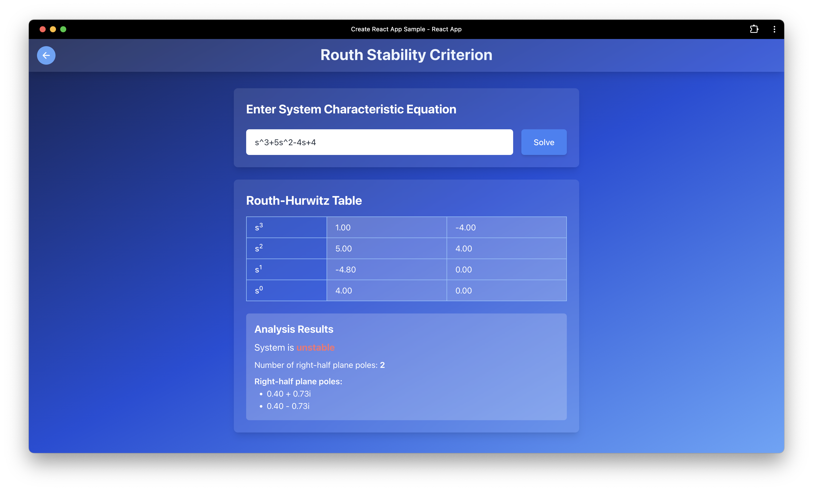

# Signal Flow Graph - Routh Stability Criterion

This project was developed as part of the our **Control Systems Basics** course at **Alexandria University** 🎓.

The project is divided into two parts:

1. **Part 1: Signal Flow Graph and Transfer Function Calculation**
   The goal of the first part is to visualize the signal flow graph of a control system and compute its transfer function using Mason’s Gain Formula.
2. **Part 2: Stability Detection using the Routh-Hurwitz Stability Criterion**
   The second part aims to assess the stability of the system by applying the Routh Stability Criterion.

   

### Tech Stack 🛠️

• Frontend: React, Konva.js 🌐
• Backend: Flask 🐍

## Part1 (Signal Flow Graph)

In control systems, a Signal Flow Graph (SFG) is a graphical representation of a set of linear algebraic equations that describe a system. It is used to model and analyze the flow of signals through different components of a system.

### Features

1. Take nodes and edges as input
2. Visualize the graph
3. Detect paths & loops
4. Calculate the transfere function of the system using Mason’s Gain Formula

   |  |  |
   | --------------------------------------------- | --------------------------------------------- |
   |  |  |

## Part2 (Routh Stability Criterion)

The Routh-Hurwitz Stability Criterion is a mathematical test used in control systems to determine the stability of a linear time-invariant system by analyzing its characteristic equation. The criterion is applied to the denominator polynomial of the system’s transfer function, which represents the system’s poles. A system is stable if all of its poles lie in the left half of the complex plane.

Features

1. Take the Characteristic Equation of the system as inout
2. Construct Routh-Hurwitz Table
3. Detect if system is stable or not
4. if system not stable detect the number and values of roots RHS roots

|  |  |
| -------------------------------------------- | ------------------------------------------------ |
